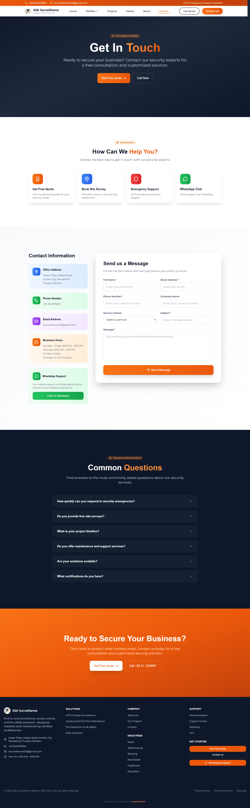

# SSK Surveillance System - Website Showcase

&gt; Professional corporate website for Pakistan's leading security solutions provider

## 🎯 Project Overview

**Client:** SSK Surveillance System SMC (Pvt.) Ltd.  
**Industry:** Security & Surveillance Technology  
**Location:** Pakistan  
**Live URL:** https://securitysurveillance.pk/

### About the Client
SSK Surveillance System is a premier Pakistani security solutions company specializing in:
- CCTV Surveillance Systems
- Access Control Solutions  
- Fire Safety & Detection Systems
- 24/7 Monitoring Services

With **500+ sites secured** across **15+ industries** and **1000+ happy clients**, SSK delivers enterprise-grade security infrastructure nationwide.

---

## 🛠️ Technical Stack

| Technology | Purpose |
|------------|---------|
| **React.js** | Component-based UI architecture |
| **Tailwind CSS** | Utility-first responsive styling |
| **Vite** | Next-generation frontend tooling |
| **JavaScript (ES6+)** | Modern JavaScript features |

---

## ✨ Key Features Implemented

### 🎨 Design & UX
- **Trust-focused visual design** - Professional blue color psychology for security industry
- **Animated statistics counters** - Dynamic display of 99.9% uptime, 500+ sites, 15+ industries
- **Responsive layout** - Seamless experience across desktop, tablet, and mobile
- **Modern corporate aesthetic** - Clean typography and strategic whitespace

### ⚡ Performance & Optimization
- **Vite-powered build** - Lightning-fast HMR and optimized production bundles
- **Tailwind purging** - Minimal CSS footprint for faster load times
- **Component reusability** - Modular React architecture for maintainability

### 🎯 Business Goals
- **Lead generation focus** - Prominent CTAs for free site surveys
- **Social proof integration** - Client logos and trust signals
- **Service showcase** - Clear presentation of security solutions portfolio
- **B2B credibility** - Professional presentation for enterprise decision-makers

---

## 📸 Screenshots

### Landing Page

*Impactful headline with professional security imagery*

### Project Page

*Animated counters displaying company achievements*

### Gallery Page

*Comprehensive security offerings presentation*

### About Page

*Portfolio of nationwide security installations*

### Contact Page

*Optimized experience for on-the-go decision makers*

---

## 🚀 Project Highlights

### Challenges & Solutions

| Challenge | Solution |
|-----------|----------|
| **Establishing trust online** | Professional design language + prominent statistics + client social proof |
| **B2B lead generation** | Strategic CTAs for free consultations and site surveys |
| **Complex service explanation** | Visual solution cards with clear iconography |
| **Mobile-first B2B audience** | Responsive design prioritizing thumb-friendly navigation |

### Performance Metrics
- ⚡ **Fast load times** via Vite optimization
- 📱 **Fully responsive** across all device sizes
- 🎨 **Consistent branding** matching SSK's corporate identity
- 🔍 **SEO-ready** structure for security industry keywords

---

## 🏆 Results & Impact

- **Live and serving** 1000+ client base
- **Lead generation hub** for new B2B security contracts
- **Brand credibility** enhancement for enterprise sales
- **Nationwide showcase** for 500+ completed installations

---

## 🔒 Note on Code

This repository contains **screenshots and documentation only** showcasing the frontend implementation. The source code is proprietary and maintained privately per client agreement.

For similar projects or collaboration inquiries, please reach out via [LinkedIn](your-linkedin-url) or email.

---

## 📞 Connect

- **Live Site:** https://securitysurveillance.pk/
- **Developer:** Rehan Munir
- **Portfolio:** https://www.behance.net/rehanmunir2
- **LinkedIn:**  inkedin.com/in/rehanmunir343/

---

*Built with ❤️ using React, Tailwind CSS, and Vite*
